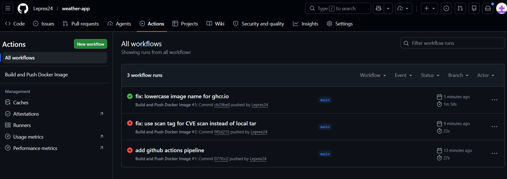

# Zadanie 2 – GitHub Actions Pipeline

## Repozytorium

- GitHub (kod + pipeline): https://github.com/leprex24/weather-app
- DockerHub (cache): https://hub.docker.com/r/leprex24/pawcho-sawicki

## Opis aplikacji

Aplikacja webowa napisana w Pythonie z użyciem frameworka Flask. Pozwala na wybór kraju
i miasta z predefiniowanej listy i wyświetla aktualną pogodę pobieraną z API OpenWeatherMap.
Po uruchomieniu kontenera aplikacja loguje datę uruchomienia, autora oraz port nasłuchiwania.

## Pipeline GitHub Actions

Plik `.github/workflows/docker-build.yml` definiuje pipeline uruchamiany automatycznie
przy każdym pushu na branch `main` lub ręcznie przez zakładkę Actions.

### Etapy pipeline

**1. Checkout** – pobranie kodu źródłowego z repozytorium.

**2. QEMU + Buildx** – konfiguracja środowiska do budowania obrazów multiplatformowych.
QEMU umożliwia emulację architektury arm64 na maszynie amd64 używanej przez GitHub Actions.

**3. Logowanie do rejestrów** – pipeline loguje się do dwóch rejestrów:
- `ghcr.io` – docelowe miejsce publikacji obrazu, token `GITHUB_TOKEN` jest
  automatycznie dostępny w GitHub Actions
- DockerHub – używany wyłącznie jako backend cache, dane logowania
  przechowywane jako sekrety repozytorium (`DOCKERHUB_USERNAME`, `DOCKERHUB_TOKEN`)

**4. Generowanie tagów** – akcja `docker/metadata-action` generuje automatycznie dwa tagi
(szczegóły w sekcji Tagowanie poniżej).

**5. Budowanie obrazu** – obraz budowany jest dla platform `linux/amd64` i `linux/arm64`
z wykorzystaniem cache z DockerHub. Na tym etapie obraz NIE jest jeszcze pushowany –
zapisywany jest lokalnie jako plik tar do późniejszego skanu.

**6. Skan CVE (Trivy)** – obraz skanowany jest narzędziem Trivy w poszukiwaniu podatności
sklasyfikowanych jako `CRITICAL` lub `HIGH`. Parametr `exit-code: '1'` powoduje że
pipeline zatrzymuje się z błędem jeśli takie podatności zostaną wykryte.
Obraz trafia do ghcr.io TYLKO jeśli skan przejdzie pomyślnie.

**7. Push na ghcr.io** – obraz publikowany jest do publicznego rejestru GitHub Container
Registry pod adresem `ghcr.io/leprex24/weather-app`.

### Konfiguracja sekretów

W ustawieniach repozytorium (Settings → Secrets and variables → Actions) skonfigurowano
dwa sekrety:

| Sekret | Opis |
|--------|------|
| `DOCKERHUB_USERNAME` | Nazwa użytkownika DockerHub |
| `DOCKERHUB_TOKEN` | Token dostępu DockerHub (Read & Write) |

Sekret `GITHUB_TOKEN` jest automatycznie dostarczany przez GitHub Actions i nie wymaga
ręcznej konfiguracji.

### Napotkane problemy

**Problem 1:** Format `docker` eksportera nie obsługuje obrazów multiplatformowych –
błąd `docker exporter does not support exporting manifest lists`.
**Rozwiązanie:** Zamiast zapisywać obraz lokalnie do pliku tar, obraz jest pushowany
do ghcr.io pod tymczasowy tag `:scan`, skanowany Trivy bezpośrednio z registry,
a dopiero po pomyślnym skanie pushowane są finalne tagi.

**Problem 2:** ghcr.io wymaga małych liter w nazwie obrazu, a `github.repository`
zwraca nazwę z oryginalną wielkością liter (`Leprex24/weather-app`).
**Rozwiązanie:** Dodano krok konwertujący nazwę repo na małe litery przez
`tr '[:upper:]' '[:lower:]'` i zapisujący wynik do zmiennej środowiskowej `IMAGE_NAME_LOWER`.

## Tagowanie obrazów

Zastosowano strategię dwóch tagów generowanych automatycznie przez `docker/metadata-action`:

| Tag | Przykład | Opis |
|-----|---------|------|
| `sha-<hash>` | `sha-a1b2c3d` | Unikalny tag powiązany z konkretnym commitem Git |
| `latest` | `latest` | Zawsze wskazuje na najnowszy obraz z brancha main |

**Uzasadnienie:** Tag `sha-<hash>` zapewnia pełną identyfikowalność i niezmienność –
każdy zbudowany obraz można jednoznacznie powiązać z konkretną wersją kodu w repozytorium,
co jest kluczowe przy debugowaniu i audycie bezpieczeństwa. Tag `latest` zapewnia wygodę
użytkowania – pozwala zawsze pobrać aktualną wersję bez znajomości hasha.

Takie podejście jest zgodne z rekomendacjami Google Cloud dotyczącymi best practices
tagowania obrazów kontenerów oraz dokumentacją akcji `docker/metadata-action`.

## Skan CVE

Do skanowania podatności użyto narzędzia **Trivy** (aquasecurity/trivy-action).
Wybrano Trivy zamiast Docker Scout ze względu na:
- dostępność jako gotowej akcji GitHub Actions bez dodatkowego logowania
- brak konieczności posiadania płatnego planu (Docker Scout wymaga subskrypcji
  dla pełnej funkcjonalności w CI)
- szerszą bazę podatności (obsługuje CVE z wielu źródeł jednocześnie)

Skan obejmuje podatności typu `os` i `library` o poziomie `CRITICAL` i `HIGH`.
Flaga `ignore-unfixed: true` pomija podatności dla których nie istnieje jeszcze
poprawka, co eliminuje fałszywe alarmy blokujące pipeline.

## Wynik działania pipeline

Pipeline został uruchomiony i zakończył się pomyślnie. Obraz dostępny jest pod adresem:

ghcr.io/leprex24/weather-app:latest

Zrzut ekranu z zakładki Actions potwierdzający poprawne wykonanie wszystkich kroków:

